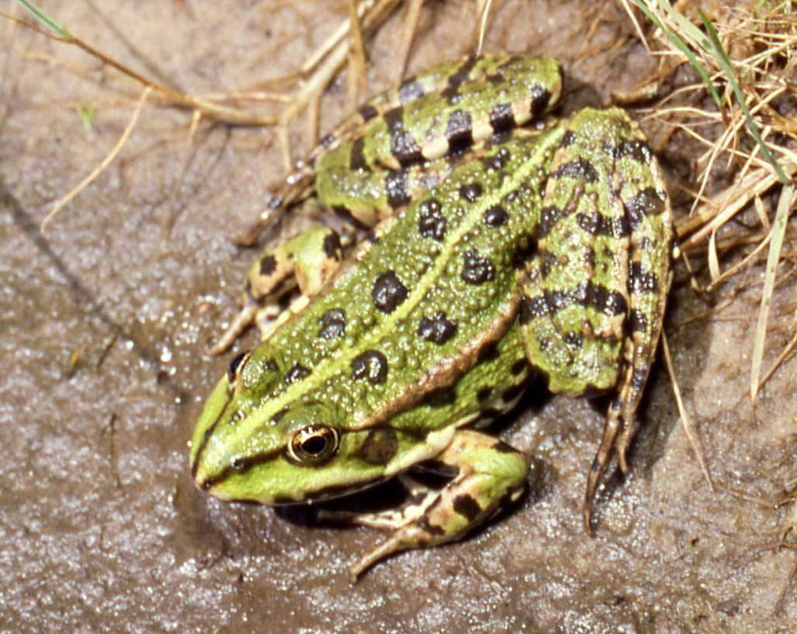



　　梁盈豪（2000年5月31日-2014年9月13日），字淫蛙，广东湛江蛙。  
　　死于蛙跳下山时撞上了不明物体。  
　　为了纪念这只特别的青蛙，贾某某为它作了两篇讣闻。

> ## 蛙说
> 韩愈、贾某某、张田鼠  
<audio controls="controls" preload="auto">
  <source src="washuo.mp3" type="audio/mpeg" />
您的浏览器不支持HTML5 audio标签。</audio>
 
> 　　世有梁淫蛙，然后有蛙man。蛙man不常有，而梁淫蛙亦不常有。故虽有淫蛙，祗辱于老师之手，骈死于作业堆之间，不以蛙man称也。  
> 　　蛙之梁淫者，一食或尽蚊一吨。食蛙者不知其为蛙man而食也。是蛙也，虽有为蛙man之能，食不饱，力不足，才美不外见，且欲与常蛙等不可得，安求其能为蛙man也？  
> 　　斥之不以其道，食之不能尽其才，鸣之而不能通其意，怒目而视之，曰：“天下无蛙！”呱呱！其真无蛙邪？其真不知蛙也。

以及

> ## Can you see a 蛙man？
> 贾某某  
<audio controls="controls" preload="auto" loop="loop">
  <source src="wasong.mp3" type="audio/mpeg" />
您的浏览器不支持HTML5 audio标签。</audio>
 
> I see a 蛙man 蛙man.  
> I see a 蛙man 蛙man.  
> I see a 蛙man 蛙man.  
> I see a 蛙man 蛙man.  
> I see a 蛙man 蛙man.  
> I see a 蛙man 蛙man.  
> I see a 蛙man 蛙man.  
> I see a 蛙man 蛙man.  
> I see a 蛙man 蛙man.  
> I see a 蛙man 蛙man.  
> I see a 蛙man 蛙man.  
> I see a 蛙man 蛙man.  
> I see a 蛙man 蛙man.  
> I see a 蛙man 蛙man.  
> I see a 蛙man 蛙man.  
> I see a 蛙man 蛙man.  
> I see a 蛙man 蛙man.  
> I see a 蛙man 蛙man.  
> I see a 蛙man 蛙man.  
> I see a 蛙man 蛙man.  
> （无限循环）
